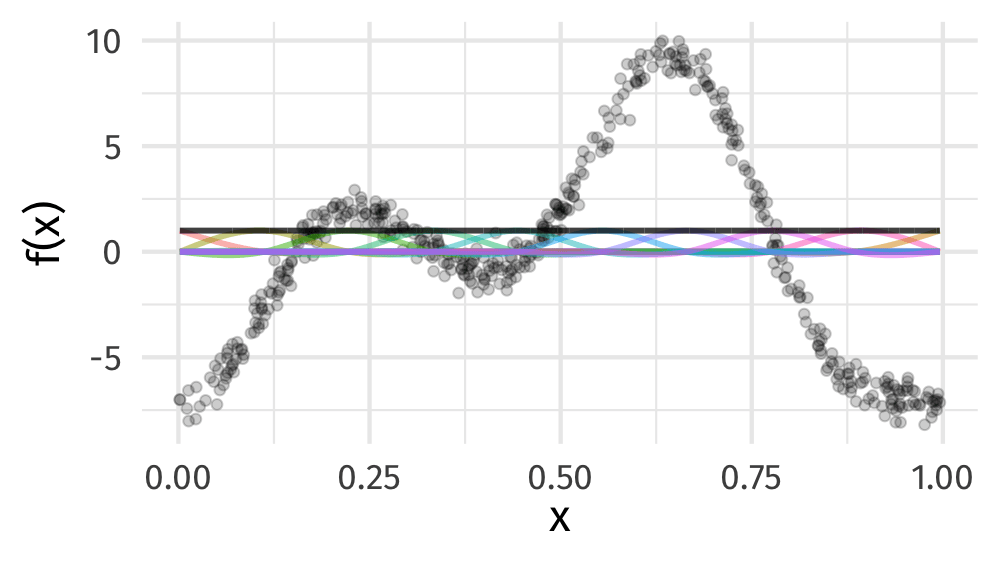

class: inverse middle center huge-subsection

```{r xaringan-tile-view, echo=FALSE}
xaringanExtra::use_tile_view()
```

```{r setup, include=FALSE, cache=FALSE, fig.show = "hide"}
options(htmltools.dir.version = FALSE)
knitr::opts_chunk$set(cache = TRUE, dev = 'svg', echo = FALSE, message = FALSE, warning = FALSE,
                      fig.height=6, fig.width = 1.777777*6, fig.align = "center")

library("curl")
library("ggplot2")
library("dplyr")
library("tibble")
library('tidyr')
library('mgcv')
library('forcats')
library('mvnfast')
library('purrr')
library('gganimate')
library('gratia')
library('readr')
library("patchwork")
theme_set(theme_minimal(base_size = 14, base_family = 'Fira Sans'))
library('readxl')
library("here")
library("Distance")
library("dsm")

## constats
anim_width <- 1000
anim_height <- anim_width / 1.77777777
anim_dev <- 'png'
anim_res <- 200
```

```{r smooth-fun-animation, results = FALSE, fig.show = "hide", include = FALSE}
f <- function(x) {
    x^11 * (10 * (1 - x))^6 + ((10 * (10 * x)^3) * (1 - x)^10)
}

draw_beta <- function(n, k, mu = 1, sigma = 1) {
    rmvn(n = n, mu = rep(mu, k), sigma = diag(rep(sigma, k)))
}

weight_basis <- function(bf, x, n = 1, k, ...) {
    beta <- draw_beta(n = n, k = k, ...)
    out <- sweep(bf, 2L, beta, '*')
    colnames(out) <- paste0('f', seq_along(beta))
    out <- as_tibble(out)
    out <- add_column(out, x = x)
    out <- pivot_longer(out, -x, names_to = 'bf', values_to = 'y')
    out
}

random_bases <- function(bf, x, draws = 10, k, ...) {
    out <- rerun(draws, weight_basis(bf, x = x, k = k, ...))
    out <- bind_rows(out)
    out <- add_column(out, draw = rep(seq_len(draws), each = length(x) * k),
                      .before = 1L)
    class(out) <- c("random_bases", class(out))
    out
}

plot.random_bases <- function(x, facet = FALSE) {
    plt <- ggplot(x, aes(x = x, y = y, colour = bf)) +
        geom_line(lwd = 1, alpha = 0.75) +
        guides(colour = FALSE)
    if (facet) {
        plt + facet_wrap(~ draw)
    }
    plt
}

normalize <- function(x) {
    rx <- range(x)
    z <- (x - rx[1]) / (rx[2] - rx[1])
    z
}

set.seed(1)
N <- 500
data <- tibble(x     = runif(N),
               ytrue = f(x),
               ycent = ytrue - mean(ytrue),
               yobs  = ycent + rnorm(N, sd = 0.5))

k <- 10
knots <- with(data, list(x = seq(min(x), max(x), length = k)))
sm <- smoothCon(s(x, k = k, bs = "cr"), data = data, knots = knots)[[1]]$X
colnames(sm) <- levs <- paste0("f", seq_len(k))
basis <- pivot_longer(cbind(sm, data), -(x:yobs), names_to = 'bf')
# basis

set.seed(2)
bfuns <- random_bases(sm, data$x, draws = 20, k = k)

smooth <- bfuns |>
  group_by(draw, x) |>
  dplyr::summarise(spline = sum(y), .groups = "drop") |>
  ungroup()

p1 <- ggplot(smooth) +
    geom_line(data = smooth, aes(x = x, y = spline), lwd = 1.5) +
    labs(y = 'f(x)', x = 'x') +
    theme_minimal(base_size = 16, base_family = 'Fira Sans')

smooth_funs <- animate(
    p1 + transition_states(draw, transition_length = 4, state_length = 2) +
    ease_aes('cubic-in-out'),
    nframes = 200, height = anim_height, width = anim_width, res = anim_res, dev = anim_dev, units = "px")

anim_save('resources/spline-anim.gif', smooth_funs)
```

# GAMs

---
class: inverse middle center subsection

# Motivating example

---

# HadCRUT4 time series

```{r hadcrut-temp-example, echo = FALSE}
URL <- "https://bit.ly/hadcrutv4"
# data are year, median of ensemble runs, certain quantiles in remaining cols
# take only cols 1 and 2
gtemp <- read_table(URL, col_types = 'nnnnnnnnnnnn', col_names = FALSE) %>%
    select(num_range('X', 1:2)) %>% setNames(nm = c('Year', 'Temperature'))

## Plot
gtemp_plt <- ggplot(gtemp, aes(x = Year, y = Temperature)) +
    geom_line() +
    geom_point() +
    labs(x = 'Year', y = expression(Temeprature ~ degree * C))
gtemp_plt
```

???

Hadley Centre NH temperature record ensemble

How would you model the trend in these data?

---

# (Generalized) Linear Models

$$y_i \sim \mathcal{N}(\mu_i, \sigma^2)$$

$$\mu_i = \beta_0 + \beta_1 \mathtt{year}_{i} + \beta_2 \mathtt{year}^2_{1i} + \cdots + \beta_j \mathtt{year}^j_{i}$$

Assumptions

1. linear effects of covariates are good approximation of the true effects
2. conditional on the values of covariates, $y_i | \mathbf{X} \sim \mathcal{N}(\mu_i, \sigma^2)$
3. this implies all observations have the same *variance*
4. $y_i | \mathbf{X} = \mathbf{x}$ are *independent*

An **additive** model addresses the first of these

---
class: inverse center middle subsection

# Why bother with anything more complex?

---

# Is this linear?

```{r hadcrut-temp-example, echo = FALSE}
```

---

# Polynomials perhaps&hellip;

```{r hadcrut-temp-polynomial, echo = FALSE}
p <- c(1,3,8,15)
N <- 300
newd <- with(gtemp, data.frame(Year = seq(min(Year), max(Year), length = N)))
polyFun <- function(i, data = data) {
    lm(Temperature ~ poly(Year, degree = i), data = data)
}
mods <- lapply(p, polyFun, data = gtemp)
pred <- vapply(mods, predict, numeric(N), newdata = newd)
colnames(pred) <- p
newd <- cbind(newd, pred)
polyDat <- gather(newd, Degree, Fitted, - Year)
polyDat <- mutate(polyDat, Degree = ordered(Degree, levels = p))
gtemp_plt +
  geom_line(data = polyDat,
            mapping = aes(x = Year, y = Fitted, colour = Degree),
            size = 1.5, alpha = 0.9) +
    scale_color_brewer(name = "Degree", palette = "PuOr") +
    theme(legend.position = "right")
```

---

# Polynomials perhaps&hellip;

We can keep on adding ever more powers of $\boldsymbol{x}$ to the model &mdash; model selection problem

**Runge phenomenon** &mdash; oscillations at the edges of an interval &mdash; means simply moving to higher-order polynomials doesn't always improve accuracy

---
class: inverse middle center subsection

# GAMs offer a solution

---

# HadCRUT data set

```{r read-hadcrut, echo = TRUE, cache = FALSE}
library("readr")
library("dplyr")
URL <-  "https://bit.ly/hadcrutv4"
gtemp <- read_table(URL, col_types = 'nnnnnnnnnnnn', col_names = FALSE) |>
  select(num_range('X', 1:2)) %>% setNames(nm = c('Year', 'Temperature'))
```

[File format](https://www.metoffice.gov.uk/hadobs/hadcrut4/data/current/series_format.html)

---

# HadCRUT data set

```{r show-hadcrut, echo = TRUE}
gtemp
```

---

# Fitting a GAM

```{r hadcrutemp-fitted-gam, echo = TRUE, results = 'hide', cache = FALSE}
library("mgcv")
m <- gam(Temperature ~ s(Year), data = gtemp, method = 'REML')
summary(m)
```

.smaller[
```{r hadcrutemp-fitted-gam, echo = FALSE}
```
]

---

# Fitted GAM

```{r hadcrtemp-plot-gam, echo = FALSE}
N <- 300
newd <- as_tibble(with(gtemp, data.frame(Year = seq(min(Year), max(Year), length = N))))
pred <- as_tibble(as.data.frame(predict(m, newdata = newd, se.fit = TRUE,
                                        unconditional = TRUE)))
pred <- bind_cols(newd, pred) %>%
    mutate(upr = fit + 2 * se.fit, lwr = fit - 2*se.fit)

ggplot(gtemp, aes(x = Year, y = Temperature)) +
    geom_point() +
    geom_ribbon(data = pred,
                mapping = aes(ymin = lwr, ymax = upr, x = Year), alpha = 0.4, inherit.aes = FALSE,
                fill = "#fdb338") +
    geom_line(data = pred,
              mapping = aes(y = fit, x = Year), inherit.aes = FALSE, size = 1, colour = "#025196") +
    labs(x = 'Year', y = expression(Temeprature ~ degree*C))
```

---
class: inverse middle center big-subsection

# GAMs

---

# Generalized Additive Models

<br />


.references[Source: [GAMs in R by Noam Ross](https://noamross.github.io/gams-in-r-course/)]

???

GAMs are an intermediate-complexity model

* can learn from data without needing to be informed by the user
* remain interpretable because we can visualize the fitted features

---

# How is a GAM different?

$$\begin{align*}
y_i &\sim \mathcal{D}(\mu_i, \theta) \\ 
\mathbb{E}(y_i) &= \mu_i = g(\eta_i)^{-1}
\end{align*}$$

We model the mean of data as a sum of linear terms:

$$\eta_i = \beta_0 +\sum_j \color{red}{ \beta_j x_{ji}}$$

A GAM is a sum of _smooth functions_ or _smooths_

$$\eta_i = \beta_0 + \sum_j \color{red}{f_j(x_{ji})}$$

---

# How did `gam()` *know*?

```{r hadcrtemp-plot-gam, echo = FALSE}
```

---
class: inverse
background-image: url('./resources/rob-potter-398564.jpg')
background-size: contain

# What magic is this?

.footnote[
<a style="background-color:black;color:white;text-decoration:none;padding:4px 6px;font-family:-apple-system, BlinkMacSystemFont, &quot;San Francisco&quot;, &quot;Helvetica Neue&quot;, Helvetica, Ubuntu, Roboto, Noto, &quot;Segoe UI&quot;, Arial, sans-serif;font-size:12px;font-weight:bold;line-height:1.2;display:inline-block;border-radius:3px;" href="https://unsplash.com/@robpotter?utm_medium=referral&amp;utm_campaign=photographer-credit&amp;utm_content=creditBadge" target="_blank" rel="noopener noreferrer" title="Download free do whatever you want high-resolution photos from Rob Potter"><span style="display:inline-block;padding:2px 3px;"><svg xmlns="http://www.w3.org/2000/svg" style="height:12px;width:auto;position:relative;vertical-align:middle;top:-1px;fill:white;" viewBox="0 0 32 32"><title></title><path d="M20.8 18.1c0 2.7-2.2 4.8-4.8 4.8s-4.8-2.1-4.8-4.8c0-2.7 2.2-4.8 4.8-4.8 2.7.1 4.8 2.2 4.8 4.8zm11.2-7.4v14.9c0 2.3-1.9 4.3-4.3 4.3h-23.4c-2.4 0-4.3-1.9-4.3-4.3v-15c0-2.3 1.9-4.3 4.3-4.3h3.7l.8-2.3c.4-1.1 1.7-2 2.9-2h8.6c1.2 0 2.5.9 2.9 2l.8 2.4h3.7c2.4 0 4.3 1.9 4.3 4.3zm-8.6 7.5c0-4.1-3.3-7.5-7.5-7.5-4.1 0-7.5 3.4-7.5 7.5s3.3 7.5 7.5 7.5c4.2-.1 7.5-3.4 7.5-7.5z"></path></svg></span><span style="display:inline-block;padding:2px 3px;">Rob Potter</span></a>
]

---
class: inverse
background-image: url('resources/wiggly-things.png')
background-size: contain

---

# Fitting a GAM in R

```r
model <- gam(y ~ s(x1) + s(x2) + te(x3, x4), # formuala describing model
             data = my_data_frame,           # your data
             method = "REML",                # or "ML"
             family = gaussian)              # or something more exotic
```

`s()` terms are smooths of one or more variables

`te()` terms are the smooth equivalent of *main effects + interactions*

$$\eta_i = \beta_0 + f(\mathtt{Year}_i)$$

```r
library("mgcv")
gam(Temperature ~ s(Year, k = 10), data = gtemp, method = 'REML')
```

---

# Generalized additive models

A GAM is a model where the effects of covariates can be represented as smooth functions learned from the data

\begin{align*}
y_i &\sim    \mathcal{D}(\mu_i, \boldsymbol{\phi}) \\
g(\mu_i) &=  \mathbf{A}_i\boldsymbol{\gamma} + \sum_{j=1} f_j(x_{ji})
\end{align*}

--

The smooth functions $f_j()$ are set up as penalized splines

---

# Splines formed from basis functions

```{r basis-functions, fig.height=6, fig.width = 1.777777*6, fig.align = "center"}
ggplot(basis,
       aes(x = x, y = value, colour = bf)) +
    geom_line(lwd = 2, alpha = 0.5) +
    guides(colour = FALSE) +
    labs(x = 'x', y = 'b(x)') +
    theme_minimal(base_size = 20, base_family = 'Fira Sans')
```


---

# Weight basis functions &#8680; spline

```{r basis-function-animation, results = "hide", echo = FALSE, include = FALSE}
bfun_plt <- plot(bfuns) +
    geom_line(data = smooth, aes(x = x, y = spline),
              inherit.aes = FALSE, lwd = 1.5) +
    labs(x = 'x', y = 'f(x)') +
    theme_minimal(base_size = 14, base_family = 'Fira Sans')

bfun_anim <- animate(
    bfun_plt + transition_states(draw, transition_length = 4, state_length = 2) +
        ease_aes("cubic-in-out"),
    nframes = 200, height = anim_height, width = anim_width, res = anim_res,
    dev = anim_dev, units = "px")

anim_save('resources/basis-fun-anim.gif', bfun_anim)
```

```{r include-basis-function-animation, fig.align = "center", echo = FALSE}
knitr::include_graphics("resources/basis-fun-anim.gif")
```

---

# Maximise penalised log-likelihood &#8680; &beta;

```{r basis-functions-anim, results = "hide", echo = FALSE, include = FALSE}
sm2 <- smoothCon(s(x, k = k, bs = "cr"), data = data, knots = knots)[[1]]$X
beta <- coef(lm(ycent ~ sm2 - 1, data = data))
wtbasis <- sweep(sm2, 2L, beta, FUN = "*")
colnames(wtbasis) <- colnames(sm2) <- paste0("F", seq_len(k))
## create stacked unweighted and weighted basis
basis <- as_tibble(rbind(sm2, wtbasis)) %>%
    add_column(x = rep(data$x, times = 2),
               type = rep(c('unweighted', 'weighted'), each = nrow(sm2)),
               .before = 1L)
##data <- cbind(data, fitted = rowSums(scbasis))
wtbasis <- as_tibble(rbind(sm2, wtbasis)) %>%
    add_column(x      = rep(data$x, times = 2),
               fitted = rowSums(.),
               type   = rep(c('unweighted', 'weighted'), each = nrow(sm2))) %>%
    pivot_longer(-(x:type), names_to = 'bf')
basis <- pivot_longer(basis, -(x:type), names_to = 'bf')

p3 <- ggplot(data, aes(x = x, y = ycent)) +
    geom_point(aes(y = yobs), alpha = 0.2) +
    geom_line(data = basis,
              mapping = aes(x = x, y = value, colour = bf),
              lwd = 1, alpha = 0.5) +
    geom_line(data = wtbasis,
              mapping = aes(x = x, y = fitted), lwd = 1, colour = 'black', alpha = 0.75) +
    guides(colour = FALSE) +
    labs(y = 'f(x)', x = 'x') +
    theme_minimal(base_size = 16, base_family = 'Fira Sans')

crs_fit <- animate(p3 + transition_states(type, transition_length = 4, state_length = 2) + 
                   ease_aes('cubic-in-out'),
                   nframes = 100, height = anim_height, width = anim_width, res = anim_res,
                   dev = anim_dev, units = "px")

anim_save('./resources/gam-crs-animation.gif', crs_fit)
```

```{r include-basis-function-anima, fig.align = "center", echo = FALSE}

```

???

Fitting a GAM involves finding the weights for the basis functions that produce a spline that fits the data best, subject to some constraints

---
class: inverse middle center big-subsection

# gratia 📦

---

# gratia 📦

{gratia} is a package for working with GAMs

Mostly limited to GAMs fitted with {mgcv} & {gamm4}

Follows (sort of) Tidyverse principles

* return tibbles (data frames)

* suitable for plotting with {ggplot2}

* graphics use {ggplot2} and {patchwork}

---

# `draw()`

The main function is `draw()`

Has methods for many of the function outputs in {gratia} and for models

---

# Plotting smooths

```{r draw-mcycle, out.width = "90%", fig.align = "center", echo = TRUE}
data(mcycle, package = "MASS")
m <- gam(accel ~ s(times), data = mcycle, method = "REML")
draw(m)
```

---

# Plotting smooths

```{r sim-four-fun-sim, fig.show = "hide", echo = TRUE}
df <- data_sim("eg1", n = 1000, seed = 42)

m_sim <- gam(y ~ s(x0) + s(x1) + s(x2) + s(x3),
  data = df, method = "REML")
draw(m_sim)
```

---

# Plotting smooths

```{r draw-four-fun-sim-plot, echo = TRUE, out.width = "95%", fig.align="center"}
draw(m_sim)
```

---

# Plotting smooths

```{r draw-mcycle-options, fig.show = "hide", echo = TRUE}
draw(m_sim,
     residuals = TRUE,           # add partial residuals
     overall_uncertainty = TRUE, # include uncertainty due to constant
     unconditional = TRUE,       # correct for smoothness selection
     rug = FALSE)                # turn off rug plot
```

---

# Plotting smooths

.center[
```{r draw-mcycle-options-plot, out.width = "95%", echo = FALSE}
draw(m_sim, residuals = TRUE, overall_uncertainty = TRUE,
     unconditional = TRUE, rug = FALSE)
```
]

---

# New in 0.9.0

Posterior simulation

<https://gavinsimpson.github.io/gratia/articles/posterior-simulation.html>

* `smooth_samples()`
    * posterior of individual smooths &mdash; model uncertainty
* `fitted_samples()`
    * posterior expectations &mdash; model uncertainty
* `predicted_samples()`
    * simulated response data &mdash; sampling variation
* `posterior_samples()`
    * uncertainty in expectation & sampling variation

---

# Ocean chlorophyll-*a* &mdash; setup

Model chlorophyll-*a* in ocean samples

```{r chl-a-setup, cache = FALSE, echo = TRUE, eval = FALSE}
library("gratia")
library("ggplot2")
library("dplyr")
```

```{r chl-a-load-data, echo = TRUE, cache = FALSE}
library("gamair")
data(chl, package = "gamair")
```

---

# Ocean chlorophyll-*a*

Use a spline on the sphere basis `bs = "sos"` for spatial smooth

```{r chl-a-model-1, echo = TRUE}
ctrl <- gam.control(nthreads = 4)
chl_m1 <- gam(
  chl ~ s(lat, lon, bs = "sos", m = -1, k = 150) +
    s(jul.day, bs = "cr", k = 20) +
    s(bath, k = 10),
  data = chl,
  method = "REML",
  control = ctrl,
  family = tw()
)
```

---

# Ocean chlorophyll-*a*

Model overview is tidy summary of the model &mdash; uses `summary.gam()` under the hood

```{r chl-overview, echo = TRUE}
overview(chl_m1)
```

---

# Ocean chlorophyll-*a* &mdash; `draw()`

```{r draw-chl-model, echo = TRUE, fig.align = "center"}
crs <- "+proj=ortho +lat_0=20 +lon_0=-37" # centre on -37 longitude
draw(chl_m1, crs = crs, dist = 0.05, rug = FALSE)
```

---

# Ocean chlorophyll-*a* &mdash; model checking

```{r chl-m1-appraise, fig.align = "center", echo = TRUE}
appraise(chl_m1, method = "simulate")
```

---

# Ocean chlorophyll-*a* &mdash; GAMLSS

Tweedie LSS model with 3 linear predictors

```{r fit-chl-lss-model, cache = TRUE, echo = TRUE}
chl_m2 <- gam(
  list(
    chl ~ s(lat, lon, bs = "sos", m = -1, k = 150) + # location
      s(jul.day, bs = "cr", k = 20) +
      s(bath, k = 10),
    ~ s(lat, lon, bs = "sos", m = -1, k = 100) +     # power
      s(jul.day, bs = "cr", k = 20) +
      s(bath, k = 10),
    ~ s(lat, lon, bs = "sos", m = -1, k = 100) +     # scale
      s(jul.day, bs = "cr", k = 20) +
      s(bath, k = 10)
  ),
  data = chl,
  method = "REML",
  control = ctrl,
  family = twlss()
)
```

---

# Ocean chlorophyll-*a*

```{r m2-overview, echo = TRUE}
overview(chl_m2)
```

---

# Ocean chlorophyll-*a* &mdash; model checking

```{r chl-m2-appraise, fig.height = 6, fig.width = 10, echo = TRUE}
appraise(chl_m2, method = "simulate")
```

---

# Ocean chlorophyll-*a*

```{r m2-draw, fig.height = 12, fig.width = 15, echo = TRUE, out.width = "65%"}
draw(chl_m2, crs = crs, dist = 0.05, rug = FALSE)
```

---

# Ocean chlorophyll-*a*

```{r sm-est-m2, echo = TRUE}
chl_m2 |>
  smooth_estimates(select = "s(lat,lon)", n = 50) |>
  add_confint()
```

---

# Ocean chlorophyll-*a* &mdash; using the model

What is the average chlorophyll-*a* in a box of the ocean 40&ndash;50&deg; N, 40&ndash;50&deg; W?

--

To answer this note

1. we don't (in this data set) have the ocean depth at each point in the box,
2. we want to ignore the day of year (`jul.day`) effect

So we'll only use the three spatial smooths & the intercept when predicting

---

# Ocean chlorophyll-*a* &mdash; using the model

```{r avg-chl, echo = TRUE, cache = FALSE}
# at what values of covariates to predict at
ds <- data_slice(
  chl_m2,
  lat = evenly(lat, lower = 40, upper = 50, by = 0.5),
  lon = evenly(lon, lower = -50, upper = -40, by = 0.5)
)
# which model terms to include
use <- c("(Intercept)", "s(lat,lon)", "s.1(lat,lon)", "s.2(lat,lon)")
# generate predictions
fv <- fitted_values(
  chl_m2,
  data = ds,
  terms = use
)
# average predicted chl-a over the grid cells
fv |>
  filter(.parameter == "location") |>
  dplyr::summarise(chl_a = mean(.fitted))
```

---

# Ocean chlorophyll-*a* &mdash; using the model

What is the average chlorophyll-*a* in a box of the ocean 40&ndash;50&deg; N, 40&ndash;50&deg; W?

--

Answer:
```{r avg-chl, echo = FALSE}
```

--

What about the uncertainty in that estimate?

---

# Ocean chl-*a* &mdash; posterior simulation

Simulate large number of draws from the posterior

```{r post-sampling-1, echo = TRUE, cache = FALSE}
fs <- fitted_samples(
  chl_m2,
  data = ds,            # where to predict; our box
  terms = use,          # include only these model terms
  n = 10000,            # how many posterior samples?
  method = "gaussian",  # Gaussian approximation is default
  unconditional = TRUE, # include uncertainty for unkown smoothing parameters
  n_cores = 4,          # use more cores for RNG
  seed = 342            # stochastic, so set a seed
)
```

---

# Ocean chl-*a* &mdash; posterior simulation

Repeat the _same_ `dplyr` code to average $\widehat{\mathtt{chl}}_i$ over the box

Only difference is we do this separately for each posterior sample (`.draw`) & then we summarise posterior `median_qi()`

```{r summarise-posterior, echo = TRUE, cache = FALSE}
library("ggdist")                    # for median_qi()
fs |>
  group_by(.draw) |>                 # do averaging for each posterior sample
  dplyr::summarise(chl_a = mean(.fitted)) |>
  median_qi()                        # median and 0.025 & 0.975 quantiles
```

---

# Some tracking-related GAM resources

* Bravington _et al_ (2021) [Variance Propagation for Density Surface Models](https://doi.org/10.1007/s13253-021-00438-2)

    * DSMs involve a detection function (distance sampling) and a GAM

    * Paper shows how to propagate uncertainty from detection function to the GAM

---

# Harbour porpoise

Example from Bravington _et al_ (2021)

```{r hp-setup, cache = FALSE}
# code from: https://github.com/dill/varprop-suppmaterials/tree/master
library("mrds")
library("dsm")
#library("plyr")
library("ggplot2")
library("gridExtra")
library("viridis")
source("R/make_ss_fs_data.R")
source("R/est_N_var_ss.R")

## 1. data setup

# load the SCANS-II data
load(url("https://github.com/dill/varprop-suppmaterials/raw/master/Supplementary_Material_B/hp.RData"))
```

```{r harbour-porpoise-example}
# bin Beaufort
ddf_data$beaufort <- cut(ddf_data$Beaufort, c(0,1,2,4), include.lowest=TRUE)
segments_data$beaufort <- cut(segments_data$Beaufort, c(0,1,2,4),
                              include.lowest=TRUE)


## 2. detection function fitting, looking at group size relationship
width <- 300
df_test <- ddf(method='ds',
               dsmodel=~mcds(formula=~size+beaufort, key="hr"),
               data=ddf_data, meta.data=list(width=width))
ddf_data <- ddf_data[ddf_data$distance <= width, ]

# plot(ddf_data$size, predict(df_test)[[1]], xlab="size", ylab="p")


## 3. chop-up the data
cut.labs <- c("Singletons", "Twos", "3-5")
fs_data <- make_ss_fs_data(ddf_data, segments_data,
                           c(0, 1, 2, 5),
                           cut.labs)
ddf_data_ss <- fs_data$obs
segments_data_ss <- fs_data$segs


## 4. fit detection function to new factor school size
df_s <- ddf(method='ds',
            dsmodel=~mcds(formula=~size_class+beaufort, key="hr"),
            data=ddf_data_ss, meta.data=list(width=width))


## 5. fit some spatial models

# dsm with school size-xy "interaction"
df_fs_chop <- dsm(count ~ s(x, y, size_class, k=20, bs="fs"),
                  ddf.obj = df_s, segment.data = segments_data_ss,
                  observation.data = ddf_data_ss, family=tw(a=1.2))

# how well does the model do?
source("R/obs_exp.R")
#print(obs_exp(df_fs_chop, ~beaufort))

## comparison with estimated abundance model
dsm_boring <- dsm(abundance.est ~ s(x, y, k=60),
          ddf.obj = df_s, segment.data = segments_data,
          observation.data = ddf_data, family=tw(a=1.2), select=TRUE)

# how well does the model do?
#print(obs_exp(dsm_boring, ~beaufort))

## 6. set up prediction data
# load("data/airgrid.RData")
# pred <- pred_grid[pred_grid$Stratum %in% area_of_interest, ]
# pre already available

# coastline for plotting
# coastline <- map_data("world", c("UK", "Ireland", "Isle of Man"))
# already in data

# prediction grid, three times
pp_ss <- rbind(pred, pred, pred)
pp_ss$off.set <- pp_ss$area*1000^2
pp_ss$size_class <- as.factor(c(rep(cut.labs[1], nrow(pred)),
                                rep(cut.labs[2], nrow(pred)),
                                rep(cut.labs[3], nrow(pred))))


## 7. variance estimation

# varprop
vp <- dsm_varprop(df_fs_chop, pp_ss)

# what are the changes to the detection function parameters?
#summary(vp)
# compare observed number of observations to expected post-varprop
#print(obs_exp(vp$refit, ~beaufort))

# collate the abundance estimates per group and estimate variance properly
ests <- est_N_var_ss(vp, ddf_data_ss, pp_ss)

# delta method per grid cell
vg <- dsm_var_gam(df_fs_chop, split(pp_ss, 1:nrow(pp_ss)), off.set=pp_ss$off.set)
vg$pred <- unlist(vg$pred)
ests_vg <- est_N_var_ss(vg, ddf_data_ss, pp_ss)


# variance for estimated abundance model for comparison
var_gam <- dsm_var_gam(dsm_boring, list(pred), off.set = pred$area*1000^2)


## 8. actually make predictions

big_plot <- pp_ss
big_plot$Abundance <- predict(df_fs_chop, pp_ss, off.set=pp_ss$off.set)

# get abundance in each group
for(size in levels(big_plot$size_class)){
  big_plot$Abundance[big_plot$size_class==size] <-
                      big_plot$Abundance[big_plot$size_class==size] *
                      median(ddf_data_ss$save_size[ddf_data_ss$size_class==size])
}

# make combined plot predictions
comb_plot <- pred
comb_plot$Abundance_t <- 0
for(size in levels(big_plot$size_class)){
  comb_plot$Abundance_t <- comb_plot$Abundance_t +
                             big_plot$Abundance[big_plot$size_class==size] *
                      mean(ddf_data_ss$save_size[ddf_data_ss$size_class==size])
}

# make estimated abundance model predictions
boring_plot <- pred
boring_plot$Abundance <- predict(dsm_boring, pred, off.set=pred$area*1000^2)


## 9. make some plots!


# make a plot per group level
plist <- list()

for(size in levels(big_plot$size_class)){
  this_plot <- big_plot[big_plot$size_class==size,]

  plist[[size]] <- ggplot(this_plot) +
    geom_polygon(data = coastline, aes(x=long, y = lat, group = group), fill="#D2D2D2") +
    geom_tile(aes(x=Longitude, y=Latitude, fill=Abundance),
              width=0.033, height=0.066)+
    coord_quickmap(#projection="mercator",
              ylim=range(this_plot$Latitude), xlim=range(this_plot$Longitude)) +
    scale_fill_viridis()+
    geom_segment(aes(x=st.lon, y=st.lat, xend=end.lon, yend=end.lat), alpha=0.4,
                 data=segments_data_ss[segments_data_ss$size_class==size, ]) +
    geom_point(aes(x=mid.lon, y=mid.lat), alpha=0.4, size=0.25,
               data=ddf_data_ss[ddf_data_ss$size_class==size, ]) +
    ggtitle(size) +
    labs(fill="Abundance") +
    theme_minimal() + theme(axis.text=element_blank(),
                            axis.title=element_blank(),
                            plot.title=element_text(size=8),
                            legend.text=element_text(size=6),
                            legend.title=element_text(size=6),
                            legend.key.height=unit(10, "pt"),
                            legend.position="bottom")
}

# put combined group model and boring model on the same scale
# not used as we don't plot the boring model in the paper
# comb_boring_fill_scale <- c(0, max(boring_plot$Abundance, comb_plot$Abundance_t))


# make the combined plot
plist[["comb"]] <- ggplot(comb_plot) +
  geom_tile(aes(x = Longitude, y = Latitude, fill = Abundance_t),
    width = 0.033, height = 0.066) +
  geom_polygon(data = coastline, aes(x = long, y = lat, group = group), fill = "#D2D2D2") +
  coord_quickmap( # projection="mercator",
    ylim = range(this_plot$Latitude), xlim = range(this_plot$Longitude)) +
  scale_fill_viridis() + # comb_boring_fill_scale)+
  geom_segment(aes(x = st.lon, y = st.lat, xend = end.lon, yend = end.lat), alpha = 0.4,
    data = segments_data) +
  geom_point(aes(x = mid.lon, y = mid.lat), size = 0.25, data = ddf_data_ss, alpha = 0.4) +
  ggtitle("Combined abundance") +
  labs(fill = "Total\nabundance") +
  theme_minimal() + theme(axis.text = element_blank(),
    axis.title = element_blank(),
    plot.title = element_text(size = 8),
    legend.text = element_text(size = 6),
    legend.title = element_text(size = 6),
    legend.key.height = unit(10, "pt"),
    legend.position = "bottom")
```

```{r hp-clean-up, cache = FALSE}
#devtools::unload("plyr", quiet = TRUE)
```

```{r plot-hp}
plist[[2]] + plist[[3]] + plist[[1]] + plot_layout(ncol = 3, nrow = 1)
```

---

# Some tracking-related GAM resources

* Presence-only data
    * Imhomogeneous Poisson Point Process
    * Log-Gaussian Cox Process
    * Dovers et al (2024) [Fitting log-Gaussian Cox processes using generalized additive model software](https://doi.org/10.1080/00031305.2024.2316725)
    * Also `ppgam` package

* Step selection
    * Animal movement & habitat preferences
    * Klappstein *et al* (2024) [Step selection analysis with non-linear and random effects in mgcv](https://doi.org/10.1101/2024.01.05.574363)

---
class: inverse center middle subsection

# Posteriors and prediction

---

# Posteriors and prediction

The following slides explain what's going on inside `fitted_values()`, `fitted_samples()`, and related posterior sampling functions.

---

# 🐡🐠🐟🦐 Species richness & 🦐 biomass

The example comes from trawl data from off the coast of Newfoundland and Labrador, Canada

* Counts of species richness at each trawl location
* Shrimp biomass at each trawl location
* Annual trawls 2005&ndash;2014

---

# 🐡🐠🐟🦐 Species richness

.row[
.col-6[
```{r load-shrimp, echo = TRUE}
shrimp <- read_csv("data/trawl_nl.csv")
```

```{r shrimp-richness, echo = TRUE}
m_rich <- gam(richness ~ s(year),
              family = poisson,
              method = "REML",
              data = shrimp)
```
]
.col-6[
```{r richness-violin, fig.height=5, fig.width=5, echo=FALSE}
ggplot(shrimp) +
  geom_violin(aes(x = richness, y = factor(year))) +
    labs(x = "Number of species", y = "Year")
```
]
]

---

# 🐡🐠🐟🦐 Species richness

```{r draw-richness-gam, out.width = "90%", fig.align = "center", echo = TRUE}
draw(m_rich)
```

---

# Spatio-temporal data

🦐 biomass at each trawl

```{r biom-space-time-plot, fig.height=8, fig.width=15, echo=FALSE, dev="png", dpi = 300, cache = FALSE}
library("sf")
coast <- read_sf("data/nl_coast.shp")
ggplot(shrimp) +
  geom_point(aes(x = long, y = lat, size = shrimp), alpha = 0.5) +
  geom_sf(data = coast) +
  facet_wrap(~year, ncol = 5)
```
---

# Spatio-temporal model

```{r fit-shrimp-space-time, echo = TRUE}
m_spt <- gam(shrimp ~ te(x, y, year, d = c(2,1),
                         bs = c('tp', 'cr'), k = c(20, 5)),
             data = shrimp,
             family = tw(),
             method = "REML")
```

---

# Predicting with `predict()`

`plot.gam()` and `gratia::draw()` show the component functions of the model on the link scale

Prediction allows us to evaluate the model at known values of covariates on the response scale

Use the standard function `predict()`

Provide `newdata` with a data frame of values of covariates

---

# `predict()`

```{r predict-newdata, echo = TRUE}
new_year <- with(shrimp, tibble(year = seq(min(year), max(year), length.out = 100)))
pred <- predict(m_rich, newdata = new_year, se.fit = TRUE, type = 'link')
pred <- bind_cols(new_year, as_tibble(as.data.frame(pred)))
pred
```

---

# `predict()` &rarr; response scale

```{r predict-newdata-resp, echo = TRUE}
ilink <- inv_link(m_rich)                         # inverse link function
crit <- qnorm((1 - 0.89) / 2, lower.tail = FALSE) # or just `crit <- 2`
pred <- mutate(pred, richness = ilink(fit),
               lwr = ilink(fit - (crit * se.fit)), # lower...
               upr = ilink(fit + (crit * se.fit))) # upper credible interval
pred
```

---

# `predict()` &rarr; plot

Tidy objects like this are easy to plot with `ggplot()`

```{r plot-predictions-richness, fig.height = 4, echo = TRUE}
ggplot(pred, aes(x = year)) + scale_x_continuous(breaks = 2005:2014) +
    geom_ribbon(aes(ymin = lwr, ymax = upr), alpha = 0.2) +
    geom_line(aes(y = richness)) + labs(y = "Species richness", x = NULL)
```

---

# `predict()` for space and time

This idea is very general;  spatiotemporal model needs a grid of x,y coordinates for each year

```{r spt-example-predict, echo = TRUE}
sp_new <- with(shrimp, expand.grid(x = evenly(x, n = 100), y = evenly(y, n = 100),
                                   year = unique(year)))
sp_pred <- predict(m_spt, newdata = sp_new, se.fit = TRUE) # link scale is default
sp_pred <- bind_cols(as_tibble(sp_new), as_tibble(as.data.frame(sp_pred)))
sp_pred
```

---

# `predict()` &rarr; response scale

```{r spt-example-response-scale, echo = TRUE}
ilink <- inv_link(m_spt)
too_far <- exclude.too.far(sp_pred$x, sp_pred$y, shrimp$x, shrimp$y, dist = 0.1)
sp_pred <- sp_pred %>% mutate(biomass = ilink(fit),
                              biomass = case_when(too_far ~ NA_real_,
                                                  TRUE ~ biomass))
sp_pred
```

---

# `predict()` &rarr; plot

```{r spt-example-plot, fig.height = 5.5, dev="png", dpi = 300, echo = TRUE}
ggplot(sp_pred, aes(x = x, y = y, fill = biomass)) + geom_raster() +
    scale_fill_viridis_c(option = "plasma") + facet_wrap(~ year, ncol = 5) + coord_equal()
```

---

# Visualizing the trend?

We have this model

.smaller[
```{r show-m-spt, echo = TRUE}
m_spt
```
]

How would you visualize the average change in biomass over time?

---

# Welcome back old friend

One way is to  decompose the spatio-temporal function in main effects plus interaction

```{r shrimp-ti-model, echo = TRUE}
m_ti <- gam(shrimp ~ ti(x, y, year, d = c(2, 1), bs = c("tp", "cr"), k = c(20, 5)) +
              s(x, y, bs = "tp", k = 20) +
                s(year, bs = "cr", k = 5),
            data = shrimp, family = tw, method = "REML")
```

and predict from the model using only the marginal effect of `s(year)`

---

# `predict()` with `exclude`

.row[
.col-6[
We can exclude the spatial & spatiotemporal terms from predictions using `exclude`

**Step 1** run `gratia::smooths()` on model & note the names of the smooth you *don't* want &rarr;
]
.col-6[
.smaller[
```{r summary-spt-ti, echo = TRUE}
smooths(m_ti)
```
]
]
]

---

# `predict()` with `exclude` &mdash; Step 2 *predict*

Prediction data only needs dummy values for `x` and `y`

```{r pred-data-ti-model, echo = TRUE}
ti_new <- with(shrimp, expand.grid(x = mean(x), y = mean(y), year = evenly(year, n = 100)))

ti_pred <- predict(m_ti, newdata = ti_new, se.fit = TRUE,
                   exclude = c("ti(x,y,year)", "s(x,y)")) #<<

ti_pred <- bind_cols(as_tibble(ti_new), as_tibble(as.data.frame(ti_pred))) %>%
    mutate(biomass = ilink(fit),
           lwr = ilink(fit - (crit * se.fit)),
           upr = ilink(fit + (crit * se.fit)))
```

`exclude` takes a character vector of terms to exclude &mdash; `predict()` sets the contributions of those terms to 0

Could also use `terms` to select only the named terms

```{r pred-data-ti-model-terms, results = "hide", echo = TRUE}
predict(m_ti, newdata = ti_new, se.fit = TRUE, terms = c("(Intercept)", "s(year)"))
```

---

# `predict()` with `exclude`&mdash; Step 3 *plot it!*

```{r plot-ti-marginal-trend, fig.height = 5, echo = TRUE}
ggplot(ti_pred, aes(x = year)) + geom_ribbon(aes(ymin = lwr, ymax = upr), alpha = 0.3) +
    geom_line(aes(y = biomass)) + labs(y = "Biomass", x = NULL)
```

---

# Using `fitted_values()`

```{r predict-via-fitted-values, out.width = "70%", fig.align = "center", echo = TRUE}
ti_pred2 <- fitted_values(m_ti, data = ti_new,
                          scale = "response",
                          exclude = c("ti(x,y,year)", "s(x,y)")) #<<

ggplot(ti_pred2, aes(x = year)) + geom_ribbon(aes(ymin = .lower_ci, ymax = .upper_ci), alpha = 0.3) +
  geom_line(aes(y = .fitted)) + labs(y = "Biomass", x = NULL)
```

---
class: inverse middle center subsection

# Posterior simulation

---

# Posterior simulation

.center[
```{r echo = FALSE, out.width = "80%", echo = TRUE}
knitr::include_graphics("resources/miller-bayesian-gam-interpretation-fig.svg")
```
]

.smaller[
Miller (2021) Bayesian Views of Generalized Additive Modelling. [*arXiv*:1902.01330v3](http://arxiv.org/abs/1902.01330v3)
]


---

# Posterior distributions

Each line is a draw from the *posterior distribution* of the smooth

Remember the coefficients for each basis function?: $\beta_j$

Together they are distributed *multivariate normal* with

* mean vector given by $\hat{\beta}_j$
* covariance matrix $\boldsymbol{\hat{V}}_{\beta}$

$$\text{MVN}(\boldsymbol{\hat{\beta}}, \boldsymbol{\hat{V}}_{\beta})$$

--

The model as a whole has a posterior distribution too

--

We can simulate data from the model by taking draws from the posterior distribution

---

# Posterior simulation for a smooth

Sounds fancy but it's only just slightly more complicated than using `rnorm()`

To do this we need a few things:

1. The vector of model parameters for the smooth, $\boldsymbol{\hat{\beta}}$
2. The covariance matrix of those parameters, $\boldsymbol{\hat{V}}_{\beta}$
3. A matrix $\boldsymbol{X}_p$ that maps parameters to the linear predictor for the smooth

$$\boldsymbol{\hat{\eta}}_p = \boldsymbol{X}_p \boldsymbol{\hat{\beta}}$$

--

Let's do this for `m_rich`

---

# Posterior sim for a smooth &mdash; step 1

The vector of model parameters for the smooth, $\boldsymbol{\hat{\beta}}$

```{r richness-coefs, echo = TRUE}
sm_year <- get_smooth(m_rich, "s(year)")     # extract the smooth object from model
idx <- gratia:::smooth_coef_indices(sm_year) # indices of the coefs for this smooth
idx

beta <- coef(m_rich)                         # vector of model parameters
beta[idx]                                    # coefs for this smooth
```

---

# Posterior sim for a smooth &mdash; step 2

The covariance matrix of the model parameters, $\boldsymbol{\hat{V}}_{\beta}$

```{r richness-vcov, results = "hide", dependson=-1, echo = TRUE}
Vb <- vcov(m_rich) # default is the bayesian covariance matrix
Vb
```

.small[
```{r richness-vcov-print, echo = FALSE, dependson=-1, echo = FALSE}
op <- options(width = 170)
Vb
options(op)
```
]

---

# Posterior sim for a smooth &mdash; step 3

A matrix $\boldsymbol{X}_p$ maps parameters to the linear predictor for the smooth

We get $\boldsymbol{X}_p$ using the `predict()` method with `type = "lpmatrix"`

```{r richness-xp-matrix, dependson=-1, echo = TRUE}
new_year <- with(shrimp, tibble(year = evenly(year, n = 100)))
Xp <- predict(m_rich, newdata = new_year, type = 'lpmatrix')
dim(Xp)
```

---

# Posterior sim for a smooth &mdash; step 4

Take only the columns of $\boldsymbol{X}_p$ that are involved in the smooth of `year`

```{r richness-reduce-xp, dependson=-1, echo = TRUE}
Xp <- Xp[, idx, drop = FALSE]
dim(Xp)
```

---

# Posterior sim for a smooth &mdash; step 5

Simulate parameters from the posterior distribution of the smooth of `year`

```{r richness-simulate-params, dependson=-1, echo = TRUE}
set.seed(42)
beta_sim <- rmvn(n = 20, beta[idx], Vb[idx, idx, drop = FALSE])
dim(beta_sim)
```

Simulating many sets (20) of new model parameters from the estimated parameters and their uncertainty (covariance)

Result is a matrix where each row is a set of new model parameters, each consistent with the fitted smooth

---

# Posterior sim for a smooth &mdash; step 6

.row[
.col-6[
Form $\boldsymbol{\hat{\eta}}_p$, the posterior draws for the smooth

```{r richness-posterior-draws, fig.height = 5, fig.show = 'hide', dependson=-1, echo = TRUE}
sm_draws <- Xp %*% t(beta_sim)
dim(sm_draws)
matplot(sm_draws, type = 'l')
```

A bit of rearranging is needed to plot with `ggplot()`
]

.col-6[
```{r richness-posterior-draws, fig.height = 5, fig.width = 5, echo = FALSE, results = 'hide'}
```
]

]

--

Or use `smooth_samples()`

---

# Posterior sim for a smooth &mdash; steps 1&ndash;6

```{r plot-posterior-smooths, fig.height = 5, dependson=-1, echo = TRUE}
sm_post <- smooth_samples(m_rich, 's(year)', n = 20, seed = 42)
draw(sm_post)
```

---

# Posterior simulation from the model

Simulating from the posterior distribution of the model requires 1 modification of the recipe for a smooth and one extra step

We want to simulate new values for all the parameters in the model, not just the ones involved in a particular smooth

--

Additionally, we could simulate *new response data* from the model and the simulated parameters (**not shown** below)

---

# Posterior simulation from the model

```{r posterior-sim-model, dependson=-1, echo = TRUE}
beta <- coef(m_rich)   # vector of model parameters
Vb <- vcov(m_rich)     # default is the bayesian covariance matrix
Xp <- predict(m_rich, type = "lpmatrix")
set.seed(42)
beta_sim <- rmvn(n = 1000, beta, Vb) # simulate parameters
eta_p <- Xp %*% t(beta_sim)        # form linear predictor values
mu_p <- inv_link(m_rich)(eta_p)    # apply inverse link function

mean(mu_p[1, ]) # mean of posterior for the first observation in the data
quantile(mu_p[1, ], probs = c(0.025, 0.975))
```

---

# Posterior simulation from the model

```{r posterior-sim-model-hist, fig.height = 5, dependson=-1, echo = TRUE}
ggplot(tibble(richness = mu_p[587, ]), aes(x = richness)) +
    geom_histogram() + labs(title = "Posterior richness for obs #587")
```

---

# Posterior simulation from the model

Or easier using `fitted_samples()`

```{r richness-fitted-samples, fig.height = 4.5, dependson=-1, echo = TRUE}
rich_post <- fitted_samples(m_rich, n = 1000, data = shrimp, seed = 42)
ggplot(filter(rich_post, .row == 587), aes(x = .fitted)) +
    geom_histogram() + labs(title = "Posterior richness for obs #587", x = "Richness")
```

---

# Why is this of interest?

Say you wanted to get an estimate for the total biomass of shrimp over the entire region of the trawl survey for 2007

You could predict for the spatial grid for `year == 2007` using code shown previously and sum the predicted biomass values over all the grid cells

--

**Easy**

--

But what if you also wanted the uncertainty in that estimate?

--

**Hard**

--

**Math** 😱😱 "something, something, delta method, something" 😱😱

---

# Posterior simulation makes this easy

1. Take a draw from the posterior distribution of the model
2. Use the posterior draw to predict biomass for each grid cell
3. Sum the predicted biomass values over all grid cells
4. Store the total biomass value
5. Repeat 1&ndash;4 a lot of times to get posterior distribution for total biomass
6. Summarize the total biomass posterior
    * Estimated total biomass is the mean of the total biomass posterior
	* Uncertainty is some lower/upper tail probability quantiles of the posterior

---

# Let's do it

```{r total-biomass-posterior-1, dependson=-1, echo = TRUE}
sp_new <- with(shrimp, expand.grid(x = evenly(x, n = 100), y = evenly(y, n = 100),
                                   year = 2007))
Xp <- predict(m_spt, newdata = sp_new, type = "lpmatrix")

## work out now which points are too far now
too_far <- exclude.too.far(sp_new$x, sp_new$y, shrimp$x, shrimp$y, dist = 0.1)

beta <- coef(m_spt)                  # vector of model parameters
Vb <- vcov(m_spt)                    # default is the bayesian covariance matrix
set.seed(42)
beta_sim <- rmvn(n = 1000, beta, Vb) # simulate parameters
eta_p <- Xp %*% t(beta_sim)          # form linear predictor values
mu_p <- inv_link(m_spt)(eta_p)       # apply inverse link function
```

Columns of `mu_p` contain the expected or mean biomass for each grid cell per area trawled

Sum the columns of `mu_p` and summarize

---

# Summarize the expected biomass

```{r total-biomass-posterior-2, dependson = -1, echo = TRUE}
mu_copy <- mu_p              # copy mu_p
mu_copy[too_far, ] <- NA     # set cells too far from data to be NA
total_biomass <- colSums(mu_copy, na.rm = TRUE)  # total biomass over the region

mean(total_biomass)
quantile(total_biomass, probs = c(0.025, 0.975))
```

---

# Summarize the expected biomass

```{r total-biomass-histogram, echo = FALSE, dependson=-1, echo = TRUE}
ggplot(tibble(biomass = total_biomass), aes(x = biomass)) +
    geom_histogram()
```

---

# With `fitted_samples()`

.row[

.col-7[
```{r biomass-fitted-samples-example, dependson=-1, echo = TRUE}
bio_post <- fitted_samples(m_spt, n = 1000,
                           data = sp_new[!too_far, ],
                           seed = 42) |>
    group_by(.draw) |>
    summarise(total = sum(.fitted),
              .groups = "drop_last")

with(bio_post, mean(total))
with(bio_post, quantile(total, probs = c(0.025, 0.975)))
```
]

.col-5[
```{r biomass-fitted-samples-plot, fig.width = 5, fig.height = 5, dependson=-1, echo = TRUE}
ggplot(bio_post, aes(x = total)) +
    geom_histogram() +
    labs(x = "Total biomass")
```

]

]

---
class: inverse center middle subsection

# Soap films

---

# Soap films

For the narrative description of what is going on in this example, see [my blog post](https://fromthebottomoftheheap.net/2016/03/27/soap-film-smoothers/) on soap film smooths, from where the code below was sourced & modernified a little

---

# Soap film smooths

```{r fs-boundary-figure, echo = TRUE}
fsb <- fs.boundary()
m <- 300
n <- 150 
xm <- seq(-1, 4, length = m)
yn <- seq(-1, 1, length = n)
xx <- rep(xm, n)
yy <- rep(yn, rep(m, n))
tru <- matrix(fs.test(xx, yy), m, n) ## truth
truth <- data.frame(x = xx, y = yy, value = as.vector(tru))

p <- ggplot(truth, aes(x = x, y = y)) +
  geom_raster(aes(fill = value)) +
  geom_contour(aes(z = value), binwidth = 0.5, colour = "white") +
  geom_path(data = as.data.frame(fsb), aes(x = x, y = y)) +
  scale_fill_viridis(na.value = NA) +
  theme(legend.position = "top", legend.key.width = unit(2.5, "cm"))
```

---

# Soap film smooths

```{r plot-fs-boundary-figure, dependson=-1}
p
```

---

# Soap films &mdash; wrong way

```{r plot-comeston-data, cache = FALSE, echo = TRUE}
library("sf")
outline <- read_sf("data/42721_Cosmeston_Lake_lake_polyline.shp")
depth <- read_sf("data/d17_42721_xyz.shp")

come_p <- ggplot(outline) +
  geom_sf() +
  geom_sf(data = depth, aes(colour = depth)) +
  coord_sf() +
  labs(y = "Northing", x = "Easting") +
  scale_color_viridis()
```

---

# Soap film smooths &mdash; wrong way

```{r plot-comeston-data-draw, echo = FALSE}
come_p
```

---

# Soap film smooths &mdash; wrong way

Fit a default spatial smoother using a thin plate spline

```{r fit-tprs-to-comeston, echo = TRUE}
tprs <- gam(-depth ~ s(os_x, os_y, k = 60), data = depth, method = "REML")
```

---

# Soap film smooths &mdash; wrong way

```{r comeston-tprs-summary, echo = TRUE}
summary(tprs)
```

---

# Soap film smooths &mdash; wrong way

Predicting from the model &mdash; old-school-style

```{r plot-tprs-comeston-set-up, echo = TRUE}
crds <- st_coordinates(outline)
grid.x <- with(tprs$var.summary,
               seq(min(c(os_x, crds[, 1])), max(c(os_x, crds[, 1])), by = 2.5))
grid.y <- with(tprs$var.summary,
               seq(min(c(os_y, crds[, 2])), max(c(os_y, crds[, 2])), by = 2.5))
pdata <- with(tprs$var.summary, expand.grid(os_x = grid.x, ox_y = grid.y))
names(pdata) <- c("os_x", "os_y")
##predictions
pdata <- transform(pdata, Depth = predict(tprs, pdata, type = "response"))
tmp <- pdata                        # temporary version...
take <- with(tmp, Depth > 0)        # getting rid of > 0 depth points
tmp$Depth[take] <- NA
```

---

# Soap film smooths &mdash; wrong way

Plot the predicted bathymetry

```{r plot-tprs-comeston-plot, echo = TRUE, fig.show = "hide"}
ggplot(outline) +
  geom_raster(data = tmp, aes(x = os_x, y = os_y, fill = Depth)) +
  geom_sf() +
  geom_sf(data = depth, size = 0.5) +
  coord_sf() +
  labs(y = "Northing", x = "Easting") +
  scale_fill_viridis()
```

---

# Soap film smooths &mdash; wrong way

```{r plot-tprs-comeston-plot, echo = FALSE}
```

Default smooth smooths across the peninsular which we don't want

---

# Soap films

Soap film smooths are one solution to this problem

The problem is generally known as _finite area smoothing_

---

# Soap film knot placement

Placing knots for soap films is tricky

The below works for simple boundaries/domains &mdash; more complex ones will need better knot filling algorithms from GIS

.small[
```{r soap-film-and-knots, echo = TRUE}
bound <- list(list(x = crds[, 1], y = crds[, 2], f = rep(0, nrow(crds))))
N <- 10
gx <- seq(min(crds[,1]), max(crds[,1]), len = N)
gy <- seq(min(crds[,2]), max(crds[,2]), len = N)
gp <- expand.grid(gx, gy)
names(gp) <- c("x","y")
knots <- gp[with(gp, inSide(bound, x, y)), ]
names(knots) <- c("os_x", "os_y")
names(bound[[1]]) <- c("os_x", "os_y", "f")
```
]

---

# Soap film knot placement

Red points are knots within the boundary

```{r soap-knot-figure, out.width = "80%"}

```

---

# Soap film model

```{r soap-film-smoother, echo = TRUE}
sf_m <- gam(
  -depth ~ s(os_x, os_y, bs = "so", xt = list(bnd = bound)),
  data = depth,
  method = "REML",
  knots = knots
)
```

Pass the boundary via `xt` argument

---

# Soap film model

```{r soap-film-summary, echo = TRUE}
summary(sf_m)
```

---

# Soap film `draw()`

```{r soap-film-plot, echo = TRUE}
draw(sf_m) & coord_fixed()
```

Needs work: should cover the domain & have a fixed coord system

---

# Soap film fitted values

Everything else in *gratia* should just work with these soap film smooths

```{r soap-film-fv, echo = TRUE}
fv <- fitted_values(sf_m, data = pdata)
```

(Except the `bs = "sf"` alternative; there's a clash with *sf* package that I reported to Simon.)

---

# Fitted soap film smooth

.row[
.col-6[
```{r soap-film-fv-plot, echo = TRUE, fig.show = "hide"}
ggplot(outline) +
  geom_raster(data = fv, aes(x = os_x, y = os_y, fill = .fitted)) +
  geom_sf() +
  geom_sf(data = depth, size = 0.5) +
  coord_sf() +
  labs(y = "Northing", x = "Easting") +
  scale_fill_viridis()
```
]
.col-6[
```{r soap-film-fv-plot, echo = FALSE, out.width = "95%", fig.align = "center"}
```
]
]

---

# Alternatives to soap films?

* For very irregular areas Dave Miller's generalized distance splines in `msg` package (Github) might be better

Miller & Wood (2014) [Finite area smoothing with generalized distance splines](https://doi.org/10.1007/s10651-014-0277-4)


---

# Find out more

Loads of examples and teaching materials in [my GAM course](https://github.com/gavinsimpson/physalia-gam-course)

Lots of posts on GAMs on my blog [fromthebottomoftheheap.net](https://fromthebottomoftheheap.net)

---

# Reuse

This slide deck is released under CC By Attribution 4.0 International Licence
